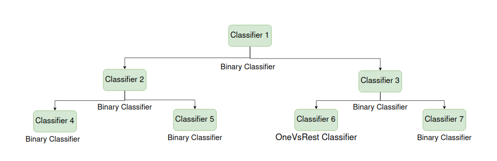
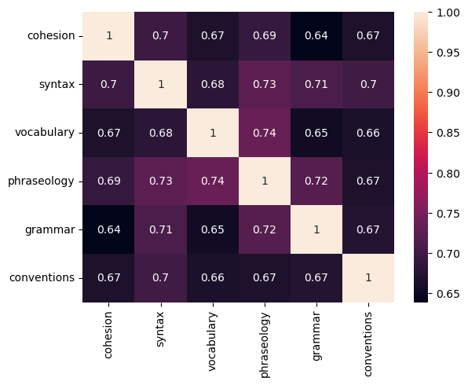
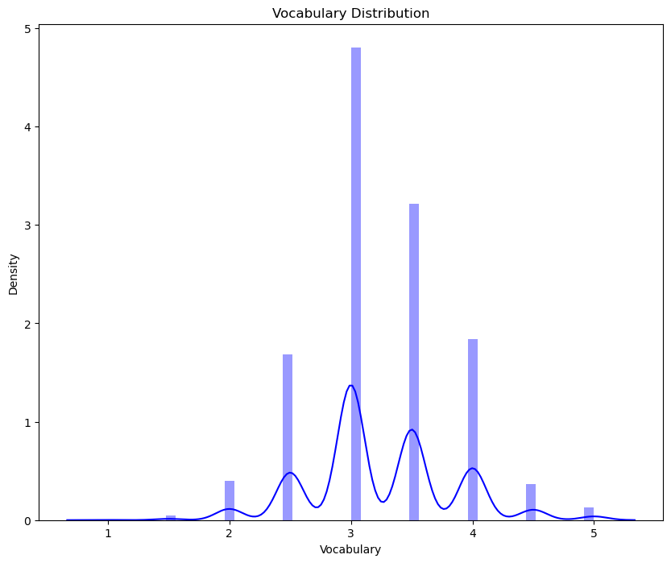
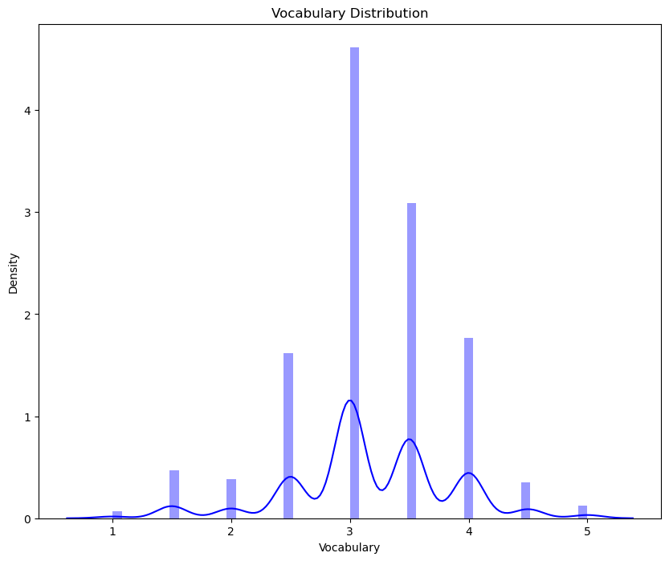
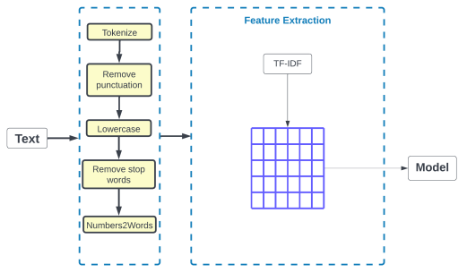

# English Language Proficiency Evaluation

### Dataset

The ELLIPSE corpus consists of 3911 argumentative essays written by 8th - 12th grade English Language Learners. The essays are scored using these analytic measures: syntax, cohesion, phraseology, grammar, conventions, and vocabulary.

[Feedback Prize English Language Learning]('https://www.kaggle.com/
competitions/feedback-prize-english-language-learning/data')

### Neural Network
### LSTM
### Support Vector Machine

Develops support vector machine algorithm using a tree like structure. 
The Evaluation of English language is a multiclass problem. Furthermore, in order to develop a model using support vector machine the problem is converter into multiple binary classifications.  

**Data Exploration**

**Data Visualization**

**Data Augmentaion**

**Preprocessing**

 

**Training**

